

  

<h3 align="center">
  <strong>
   A Comprehensive Dictionary of all the essential guides, resources and tools in every aspect of software development.
  </strong>
</h3>

  

<h2></h2>

**[⬆ back to top](#title)**

---

# Self-Hosting Guide, Devops & DevSec Ops and A guide to Security in development.

### I. Self-Hosting Guide.

Tools to use: 
* i. [Coolify](https://github.com/coollabsio/coolify) – Open Source alternative to Heroku, Netlify, Render and Vercel that make deployment easy and simple.
* ii. [Dokploy](https://github.com/Dokploy/dokploy) – Another Open Source alternative to Heroku, Netlify, Render and Vercel that make deployment easy and simple.
* iii. Hetzner for VPS/ KVM VPS – As of 4th July 2024 Hetzner is the best source for quality VPS because of its good mix of affordability and value meaning it has many server options and you can get what you need for a relatively good price.
Depending on the use case, for production grade deployments (non CPU and Traffic/bandwidth heavy applications) buy the 40-50 dollar VDS in which you can host 2-3 applications like this. For other CPU, Traffic/Bandwidth heavy applications buy the 100-500 dollar VDS. Changes can be made when you reach a point where you both need the capacity and you have the resources for it in which you can just pay for really expensive 500-1000 dollar VDS and consolidate all your applications to just that one VDS.
For personal/hobby use the 5-10 dollar VPS are good.
		iv. Various Linux distros and open source cloud systems like Casa OS can be installed.

### II. Devops Guide.

Refer to the following Github Repository`s:

* Devops guide -  i. Devops tutorials [https://github.com/antonputra/tutorials](https://github.com/antonputra/tutorials)
                  ii.  Roadmap [https://github.com/milanm/DevOps-Roadmap](https://github.com/milanm/DevOps-Roadmap)
* Ansible - [Ansible for devops examples](https://github.com/geerlingguy/ansible-for-devops)
* Terraform- i.[Hashicorp Terraform Resources](https://github.com/shuaibiyy/awesome-tf)
              ii.[AWS elastic kurbenetes starter kit](https://github.com/Devgurusio/terraform-aws-eks-ecommerce)
* Kubesphere - [Platform tailored for kurbenetes multi-cloud, data center and edge management.](https://github.com/kubesphere/kubesphere)

  

### III. DevSecOps

Refer to this Guide: [https://github.com/sottlmarek/DevSecOps](https://github.com/sottlmarek/DevSecOps)

**[⬆ back to top](#title)**
---

# B2B & B2C Software Design.

### I. Testing Tools.

**Notes:** To be Updated

### II. API Keys.
**Notes:** To be Updated

* Unkey

The following Repo Contains free api keys [https://github.com/public-apis/public-apis](https://github.com/public-apis/public-apis)

### III. Authentication.

* Custom
* AWS Cognito
* Next-Auth
* AuthO
* Clerk
* Firebase

  <a href="#">
    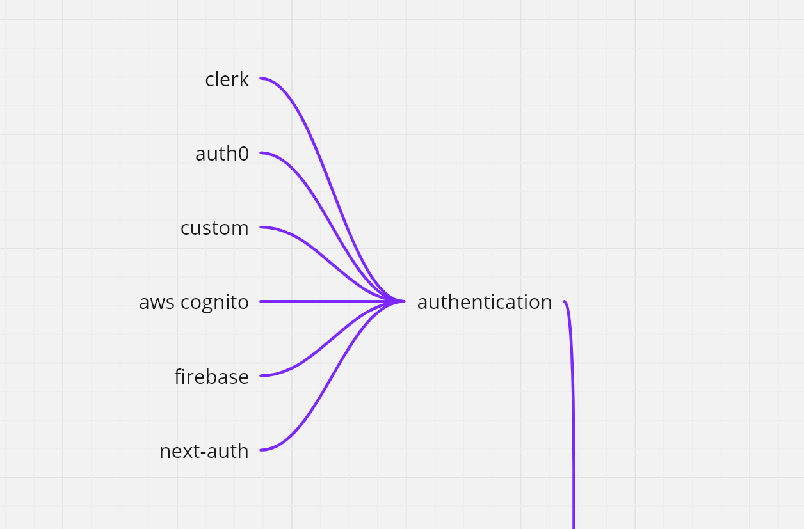
  </a>

### IV. CI/CD.

* Github Actions
* Jenkins
* Travis CI
* GoCD
* CircleCI

 **Notes:** Alternatives: CI/CD tools provided by Cloud Providers e.g. AWS & Azure devops or you can build your own if it’s necessary and you have the manpower, time and money for it.

  <a href="#">
    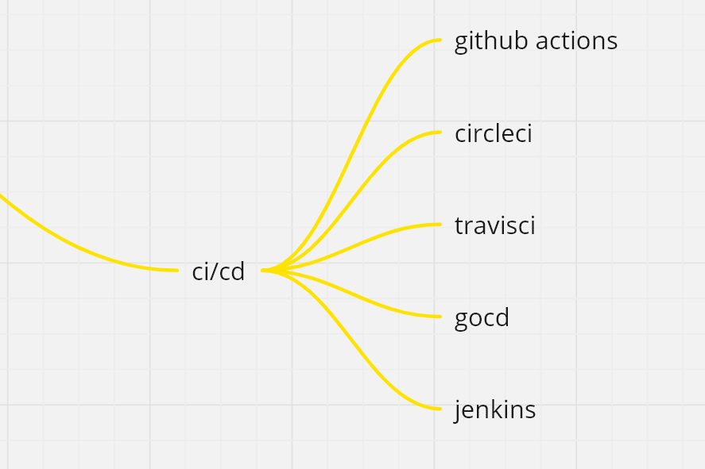
  </a>

### V. Communication

* Slack
* Mattermost
* Microsoft Teams
* Discord
* Zoom
* Open source Self Hostable & Customizable Versions can be found.

  <a href="#">
    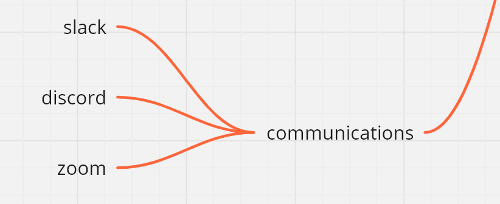
  </a>

Alternatives: Self hosted Open Source Communication.e.g. Mattermost

### VI. Search.

* Medusa
* Splitter
* LaunchDarkly
* Open source Self Hostable & Customizable Versions can be found.

  

### VII. Database

* AWS Dynamo
* Supabase
* Convex
* Mongo Atlas
* PlanetScale
* Firebase

  <a href="#">
    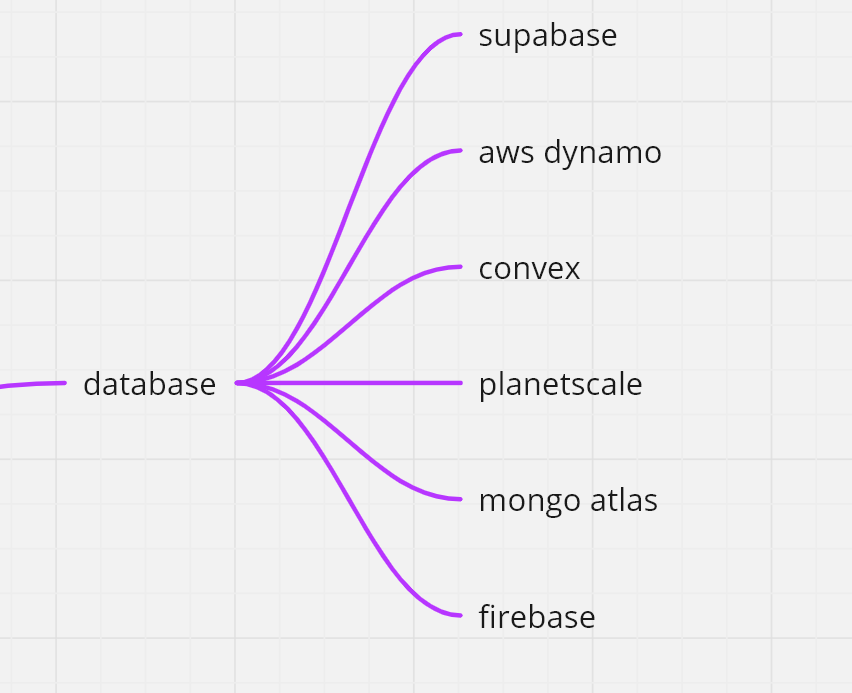
  </a>

### VIII. Documentation.

* Github MD
* Miro
* Eraser
* Docsify
* Nextra
* Open source Self Hostable & Customizable Versions can be found.

  <a href="#">
    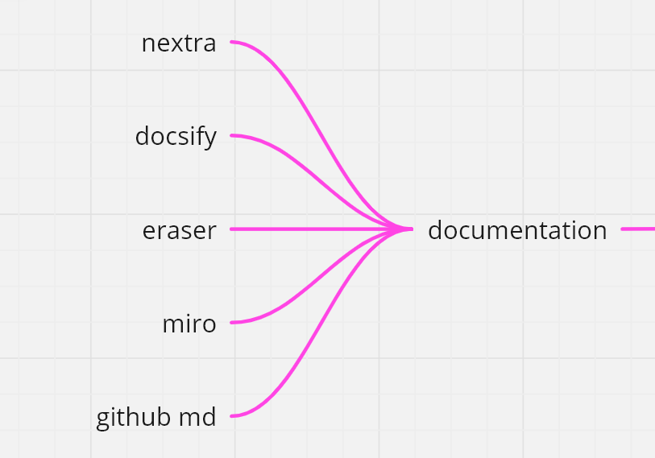
  </a>

### IX. Email.

* AWS SES
* Sendgrid
* Mailgun

  <a href="#">
    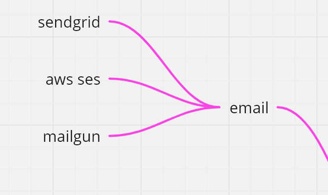
  </a>

### X. Events.

* Pusher
* Kafka
* AWS WebSockets

  <a href="#">
    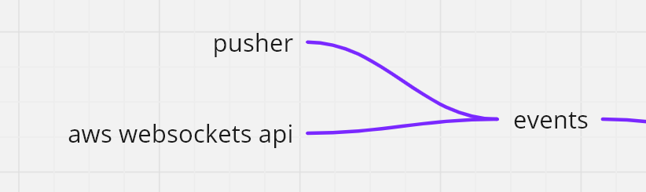
  </a>

### XI. Feedback.

* Zendesk
* Intercom
* Canny
* Open source Self Hostable & Customizable Versions can be found.

  <a href="#">
    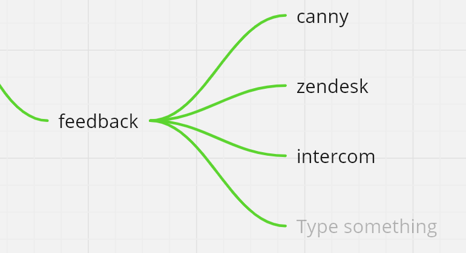
  </a>

### XII. Design.

Design in Figma.
Hold Competitions between designers using this website: 

* Figma

  <a href="#">
    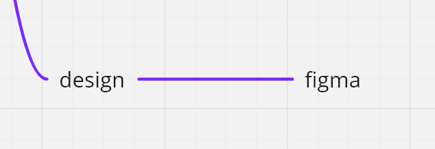
  </a>

### XIII. File Storage.

* AWS S3 Bucket
* Cloudinary
* Uploadthing
* Self Host using a VPS and NextCloud

  

### XIX. Hosting.

* AWS
* Google GCP
* Digital Ocean
* Self Host
* Vercel
* Netlify
* Render

For cloud use AWS free tier or serverless option.
 **Notes:** Set budget alerts and automated kill switches for over budgets and dont configure something you are not supposed. To prevent this from happening never configure from AWS GUI, always configure using `CONFIG` files and `SDKs`

For VPS and KVM VPS use Hetzner or Hostinger $60-dollar plan. 
 **Notes:** Buy from Hetzner Auctions for production grade releases & 5-10 dollar Hetzner VPS for small personal projects

  <a href="#">
    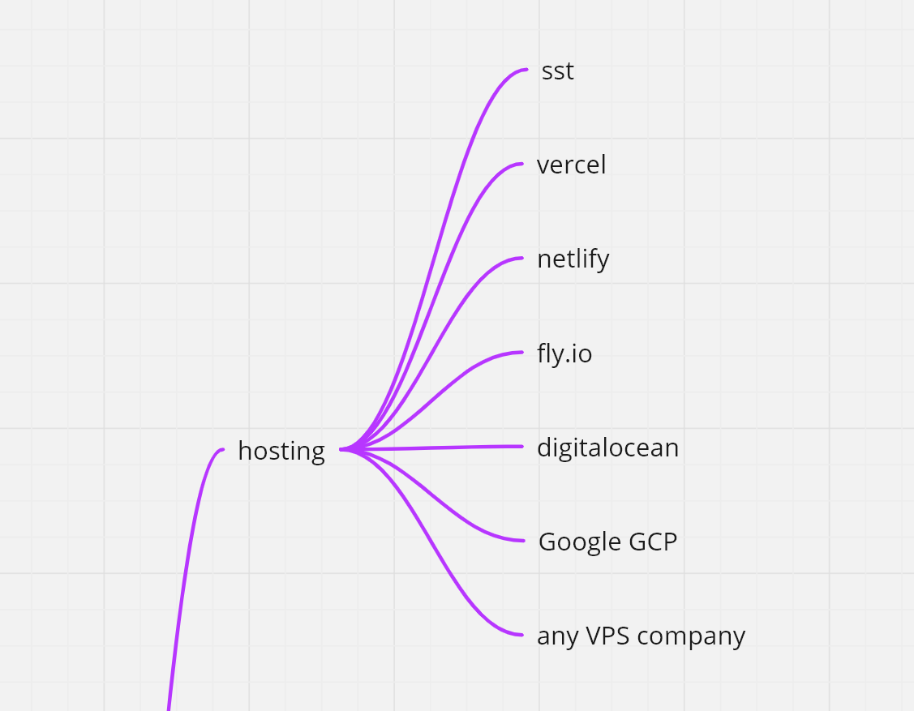
  </a>

### XV. Issue Tracking.

* Github Issues
* Jira
* Trello

  

### XVI. Version Control

* Git
* SVN
* Mercurial

  

### XVII. SMS

* AWS SNS
* Twilio
* Local Providers
*

  <a href="#">
    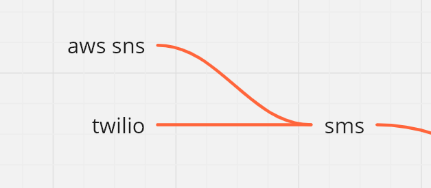
  </a>

### XVIII. Logging.

* AWS Cloudwatch
* Datadog
* Axios FM
* Elastic Search [ELK]
* Splunk
* New Relic
* Kafka
* Loki for logs aggregation
* Promtail for log fetching and labelling

  <a href="#">
    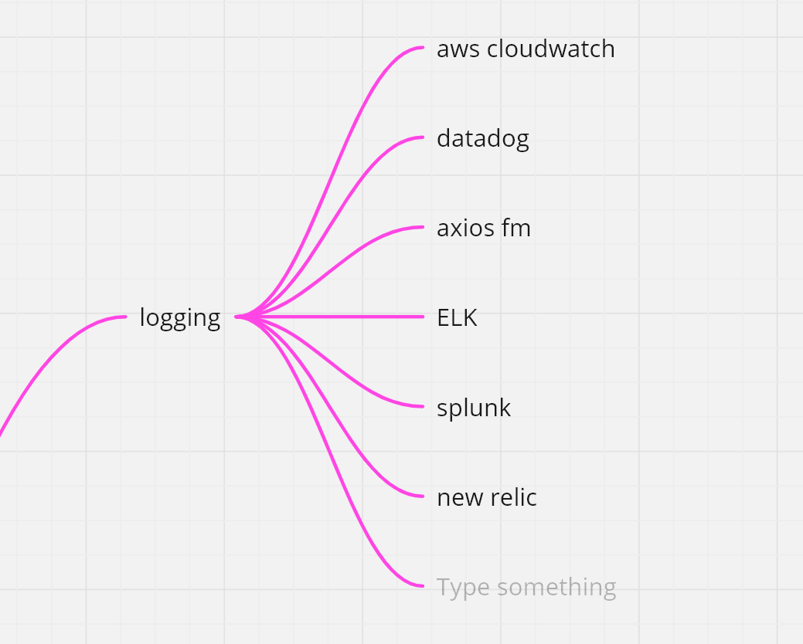
  </a>

### XIX. Marketing.

* Sponsored Videos
* TV & Radio Ads
* Email
* Affiliate Links
* SMS Marketing
* Social media Ads - Facebook, Instagram, Twitter, Linked in, WhataApp, Reddit.
* Search Engine Ads - Google, Google Maps

  <a href="#">
    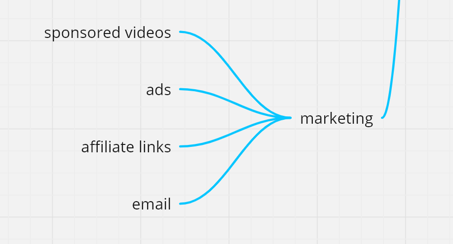
  </a>

### XX. Payment Processing.

* Stripe
* Paypal

Other Options maybe be added depending on use case.e.g. cashapp/venmo/wise/western union/MoneyGram.

  

### XXI. Monitoring

* Prometheus for application monitoring
* Net Data for Server Monitoring

### XXII. Dashboards

* Grafana
* Tremor
* NetData

### XXIII. AI and Machine Learning

* Hugging Face - [https://github.com/huggingface](https://github.com/huggingface) 
* Awesome Machine Learning - [https://github.com/josephmisiti/awesome-machine-learning](https://github.com/josephmisiti/awesome-machine-learning) 

### XXIV. Frontend Resources

* Frontend Checks - [https://github.com/thedaviddias/Front-End-Checklist](https://github.com/thedaviddias/Front-End-Checklist) 

### XXV. Templates and Boilerplates

* [.NET](https://github.com/kriasoft/aspnet-starter-kit) - https://github.com/kriasoft/aspnet-starter-kit 
* [React](https://github.com/mcnamee/react-native-starter-kit) - https://github.com/mcnamee/react-native-starter-kit 
* [Nextjs](https://github.com/boxyhq/saas-starter-kit) - https://github.com/boxyhq/saas-starter-kit
* [Vue&.NET](https://github.com/alirizaadiyahsi/Nucleus) - https://github.com/alirizaadiyahsi/Nucleus 
* [SaaS](https://github.com/boxyhq/saas-starter-kit ) - https://github.com/boxyhq/saas-starter-kit 

**[⬆ back to top](#title)**

---

# Programming Standards and Error/Bug Prevention Techniques. [ Use Linters, Automated Tests to enforce them.]

Best practices that developers adhere to when writing code to ensure consistency, readability, and maintainability.
      * Indentation and Formatting: ? Use consistent indentation and formatting.
      * Comments: ? Include clear and concise comments. 
      * Naming Conventions: ? Use descriptive and consistent names. 
      * Function Length: ? Keep functions short and focused. 
      * Error Handling: ? Implement proper error handling with meaningful messages. 
      * Code Duplication: ? Minimize code duplication; refactor when necessary. 
      * Testing: ? Write and maintain unit tests. 
      * Performance: ? Optimize code for performance when needed.
Refer to this GitHub repo for better explanation [https://github.com/Kristories/awesome-guidelines](https://github.com/Kristories/awesome-guidelines) , JavaScript guidelines [https://github.com/airbnb/javascript](https://github.com/airbnb/javascript) 

Links to tools used to enforce this:
**Notes** To add

## License

**MIT License**

**[⬆ back to top](#title)**